!SLIDE
# Statecharts
### Corey Burrows
### May 24, 2011

!SLIDE smaller
# The Problem: How do you keep track of your application's state?

!SLIDE bullets incremental
# What do we mean by _state_?

* An app's current state is the exact configuration of its views at any given time.
* An app's state typically changes frequently.
* State changes are triggered by _events_ and are called _transitions_.

!SLIDE
# Quick Demo

!SLIDE small
# So how do you implement this?

!SLIDE bullets smaller
# The naive way

    @@@ javascript
    ignitionButton: SC.ButtonView.create({
      title: function() {
        return Car.get('isOn') ? 'Turn Off' : 'Turn On';
      }.property(),

      isDisabled: function() {
        return !Car.get('keyIn') || Car.get('isMoving');
      }.property()
    })

* Each view is responsible for knowing its current state.
* State logic is spread throughout the application.
* Quickly leads to spaghetti code.

!SLIDE bullets
# A better way: Finite State Machines

* Keeps all of your state logic in one place.
* Works great as long as your number of states is small.

!SLIDE center
# FSM Car example
 

!SLIDE center
# FSM Car example
 

!SLIDE center
# FSM Car example
 

!SLIDE center
# FSM Car example
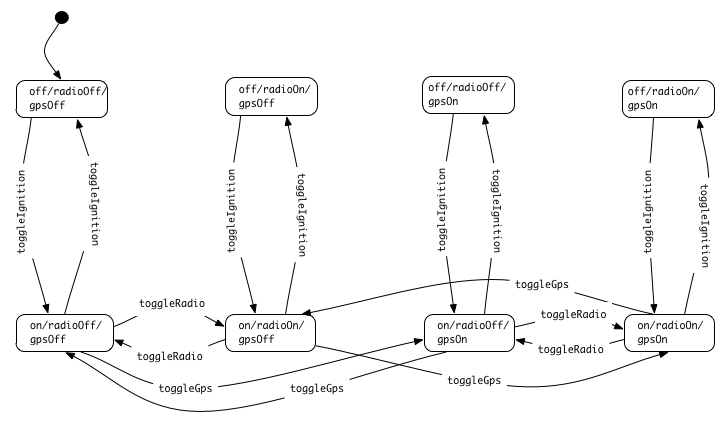 

!SLIDE center
# Solution: Statecharts!
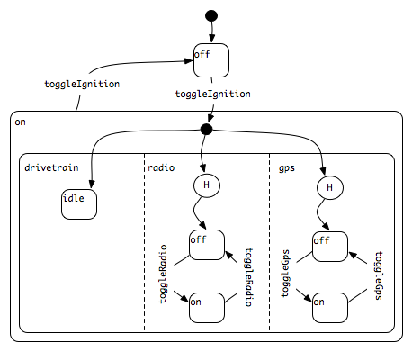 

!SLIDE bullets
# What is a statechart?

* A visual diagram for describing the behavior of a system.
* `SC.Statechart` - A framework for SproutCore that provides an API for defining and interacting with a statechart object.

!SLIDE bullets
# Features

* hierarchical states
* orthogonal states
* history states

!SLIDE bullets smaller
# Hierarchical states

* A parent state is the XOR of its substates.
* To be in state P, one must be in either state C1 or state C2, but not both.
* P is an abstraction of C1 and C2 and allows you to denote common properties of both in an economical way.
* **Important:** A statechart's current state must always be leaf state.

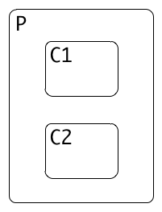 

!SLIDE bullets smaller
# Orthogonal (Parallel) states

* AND decomposition: being in a state - the system must be in all of its components.
* At any given point in time a statechart will be in a vector of states whose length is not fixed.
* `(A ⊕ B) ∧ (C ⊕ D) ∧ (E ⊕ F)`
* Eg: `P1.A, P2.D, P3.E`
* Syncronicity - a single event causes multiple simultaneous happenings.

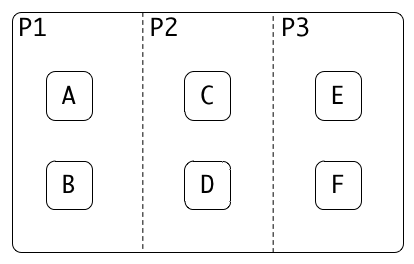 

!SLIDE bullets center smaller
# History states

* When entering this parent state, transition to the most recently exited child state.
* If this is the first time entering this parent state, transition to the default child state.
 

!SLIDE bullets
# Events

* Usually triggered by the user (e.g. clicking a button, focusing a field, etc.)
* When an event is sent to the statechart, each current state is given the opportunity to handle it. 
* Events bubble up the parent state chain.

!SLIDE bullets
# Transistions
* When a state handles an event, it typically triggers a state transition.
* Transitions start from the current state (or states) and traverse up to the pivot state, triggering exit state handlers along the way.
* From the pivot state, child states are traversed, triggering enter state handlers until the final substate is reached.

!SLIDE center
### `C1.2 -> C2.1`
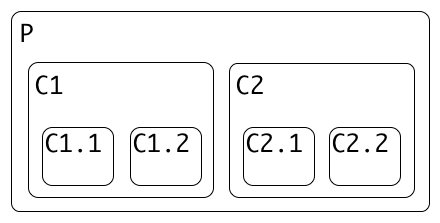

!SLIDE center
### `C1.2 -> C2.1`
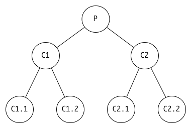

!SLIDE center
### `C1.2 -> C2.1`
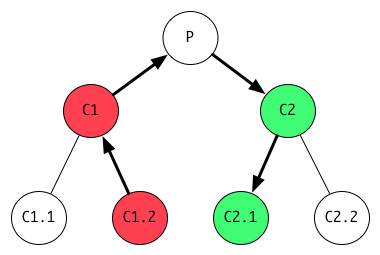

!SLIDE center
### `(W.P1.B, W.P2.D, W.P3.E) -> W.X.Z`
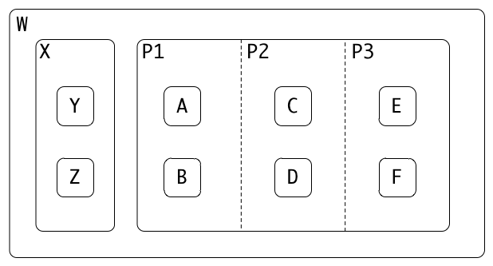

!SLIDE center
### `(W.P1.B, W.P2.D, W.P3.E) -> W.X.Z`
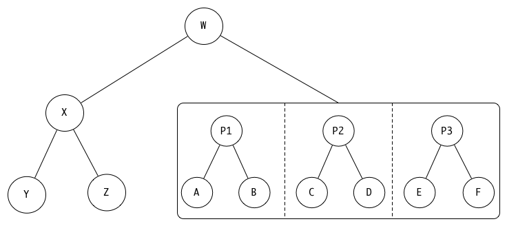

!SLIDE center
### `(W.P1.B, W.P2.D, W.P3.E) -> W.X.Z`
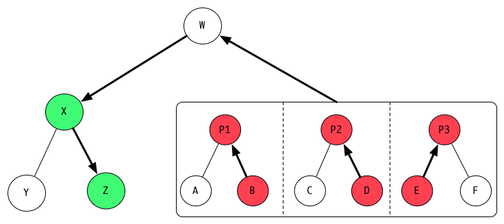

!SLIDE center
### `W.X.Z -> (W.P1.B, W.P2.D, W.P3.E)`
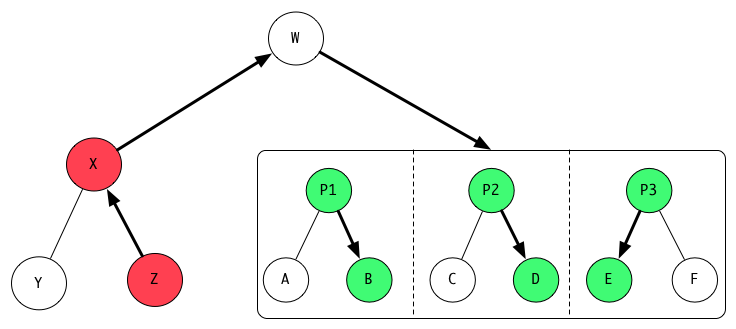

!SLIDE center
# `SC.Statechart` example
 

!SLIDE bullets smaller
# References

* github.com/burrows/statechart-presentation
* www.wisdom.weizmann.ac.il/~harel/papers/Statecharts.pdf
* www.wisdom.weizmann.ac.il/~harel/papers/Statecharts.History.pdf 
