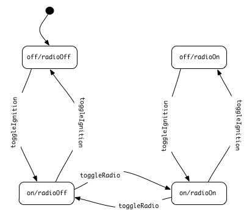
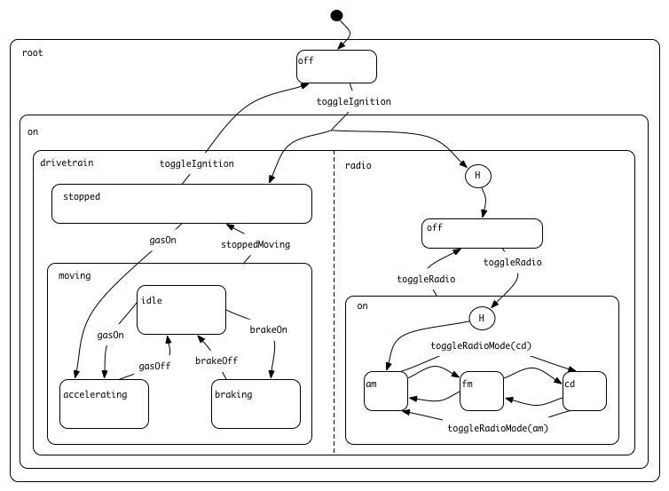

!SLIDE
# Statecharts

!SLIDE smaller
# The Problem: How do you keep track of your application's state?

!SLIDE bullets incremental
# What do we mean by _state_?

* The exact configuration of your views at any given time.
* Eg. When the car is turned on and the radio is turned on, the radio mode selector should be enabled.
* An app's state typically changes frequently.
* State changes are triggered by _events_ and are called _transitions_.

!SLIDE small
# So how do you implement this?

!SLIDE bullets smaller
# The naive way

    @@@ javascript
    submitOrderButton: SC.ButtonView.create({
      isEnabled: function() {
        return MyApp.userController.get('isAuthenticated') &&
               MyApp.creditCarController.get('isValid') &&
               MyApp.orderController.get('allItemsInStock');
      }.property()
    })

* Each view is responsible for knowing its current state.
* State logic is spread throughout the application.

!SLIDE smaller bullets
# The naive way

* An app's state is calculated from a bunch of properties spread out across the app.
* Becomes increasingly difficult to understand as complexity increases.
* Difficult to change.
* Quickly leads to spaghetti code.

!SLIDE bullets
# A better way: Finite State Machines

* Keeps all of your state logic in one place.
* Works great as long as your number of states is small.

!SLIDE center
# FSM Car example
 

!SLIDE center
# FSM Car example
 

!SLIDE center
# FSM Car example
 

!SLIDE center
# Solution: Statecharts!
 

